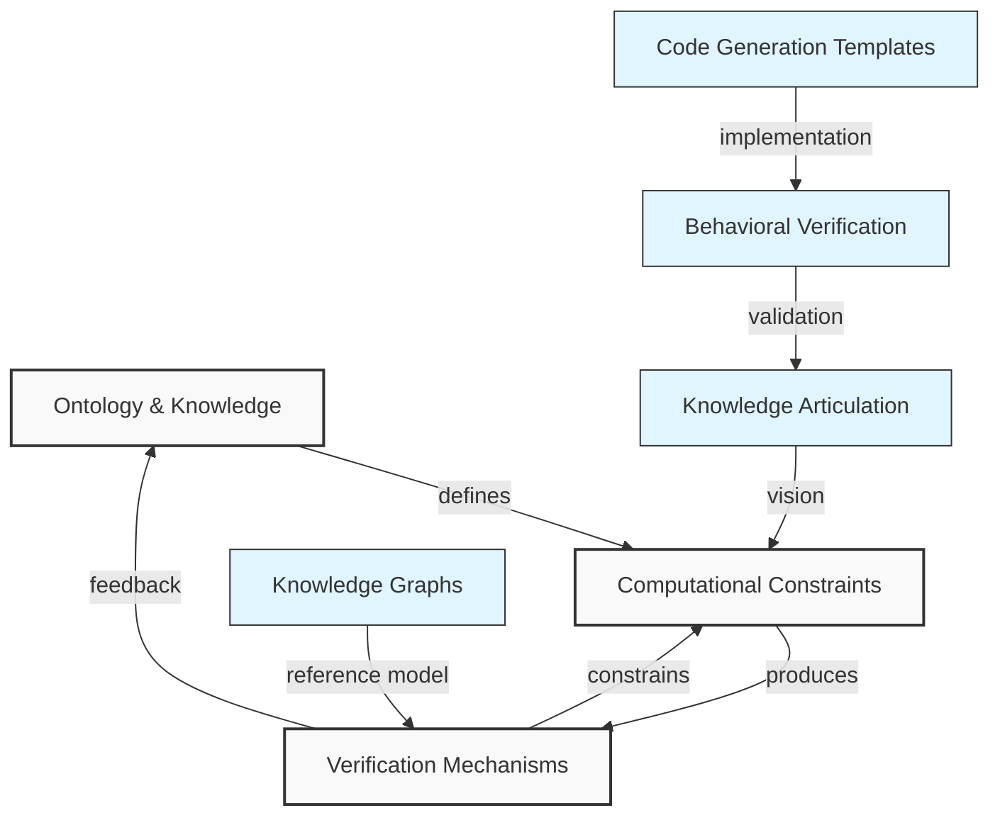
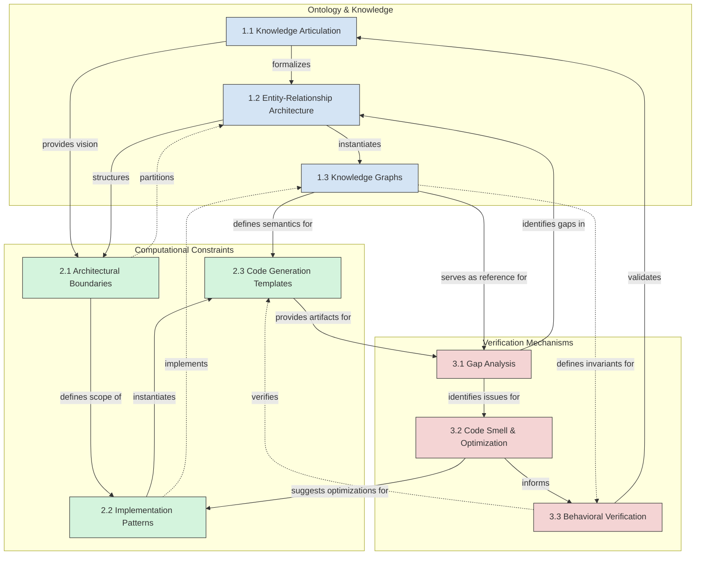

# Computational Mental Models Framework

**Version 0.1 (2025-05-10)**

## Executive Summary

The Computational Mental Models framework establishes a structured approach for translating human mental models into computational representations through constrained AI-assisted development. It provides architectural guidelines, design patterns, and evaluation mechanisms that prevent code divergence and maintain project integrity while enabling both AI and human contributors to collaborate effectively within a shared understanding of the system's conceptual foundations.

Rather than allowing free-form development that leads to "spaghettification" and feature creep, this framework establishes clear processes for articulating mental models, implementing them within defined constraints, and verifying their correctness. The framework consists of three interconnected clusters, each containing three key concepts that work together to bridge the gap between human understanding and computational implementation.

------

## 1. Framework Purpose & Scope

### Purpose Statement

This framework guides and constrains the development of software projects by:

- Elucidating mental models for computational representation
- Establishing project architecture and code base layout
- Driving software design through curated design patterns
- Providing source code templates for bootstrapping
- Defining an opinionated contributor's guide
- Providing mechanisms to evaluate quality, performance, and behavior

In AI-assisted development contexts, this framework provides constraint and consistency guidance, preventing divergence and maintaining alignment between mental models and their computational implementations.

### Stakeholders

The primary stakeholder roles include:

1. **Developers** (AI/Human) - Code producers working within the constraints
2. **System Architects** (AI/Human) - Pattern definers and semantic guides
3. **Principal Architects** (AI/Human) - Multi-project orchestrators and framework enforcers

### Working Scope

- Focus on first principles, architectural patterns, and practical constraints
- Designed to prevent "spaghettification" and feature creep in AI-generated code
- Must include evaluation mechanisms to measure adherence to the mental model
- Should be concrete enough to generate templates and documentation
- Framework prioritizes automation and consistency over innovation
- Emphasizes readability and simplicity to reason about

------

## 2. Framework Components

### Cluster 1: Ontology & Knowledge

1. **Knowledge Articulation**
    The process of evolving mental models from overloaded statements to pedantic or formal formats.
2. **Entity-Relationship Architecture**
    Structure of entities, attributes, and their relationships.
3. **Knowledge Graphs**
    Interconnected representation of domain knowledge and relationships.

### Cluster 2: Computational Constraints

1. **Architectural Boundaries**
    System-level organization and component interfaces.
2. **Implementation Patterns**
    Permitted code structures and design paradigms.
3. **Code Generation Templates**
    Standardized artifacts that enforce consistency.

### Cluster 3: Verification Mechanisms

1. **Gap Analysis**
    Elucidating the marginal difference between the computational model & the mental model.
2. **Code Smell & Optimization**
    Static & Dynamic analysis of the code base & computational model performance.
3. **Behavioral Verification**
    Metrics & Heuristics for confirming that system behaviors accurately reflect mental model expectations at runtime.

------

## 3. Boundaries & Assumptions

### Scope Boundary Statement

**Ontology & Knowledge**

- This framework does NOT attempt to create general AI cognition models
- We are NOT designing a universal knowledge representation
- We are focused on domain-specific mental models that can be explicitly articulated

**Computational Constraints**

- The framework is applicable across all project types and domains
- The framework provides structure for automated development, enabling rapid exploration and refinement
- Structure and consistency are prioritized, with performance optimization as a secondary but important goal
- The framework does NOT prescribe specific programming languages (though implementations might)

**Verification Mechanisms**

- We are NOT building a formal verification system for mathematical correctness
- The framework does NOT guarantee bug-free code
- We are focused on rapid development of functional systems, not code golf
- We prioritize structural and behavioral alignment with mental models

### Assumption List

- Mental models can be adequately formalized for computational implementation
- The gap between mental and computational models can be measured objectively
- AI agents can follow structural constraints when properly guided
- Standardized templates and patterns enhance rather than limit effective development
- A constrained approach produces functional solutions faster than an unconstrained approach
- Projects will develop iteratively; first versions are not expected to be final
- Mental models will be added, refined, and evolved through implementation attempts
- Automation manages many risks associated with large or verbose projects

### Glossary

**Mental Model**: An internal conceptual framework that represents a person's understanding of how something works in the real world.

**Computational Model**: A formal, executable representation of a system or concept implemented in code.

**Knowledge Articulation**: The process of transforming informal or implicit mental models into explicit, formal representations suitable for computational implementation.

**Entity-Relationship Architecture**: The structure defining how domain objects relate to each other, their attributes, and their behaviors.

**Knowledge Graph**: A network representation of interconnected entities, relationships, and facts about a domain.

**Architectural Boundary**: A defined separation between components or systems that specifies interfaces and interaction protocols.

**Implementation Pattern**: A standardized approach to solving specific design or coding problems within the constraints of the framework.

**Code Generation Template**: Predefined code structures that enforce consistency and architectural alignment.

**Gap Analysis**: The systematic examination of differences between the mental model and its computational implementation.

**Code Smell**: An indicator of potential problems in code structure, design, or implementation that might hinder maintenance or performance.

**Behavioral Verification**: The process of confirming that a system's runtime behavior matches the expectations defined in the mental model.

------

## 4. Component Relationships

### Relationship Overview Diagram

### Concept-Level Relationship Matrix

Legend:

- `—` : Self-reference (main diagonal)
- `⦰` : No direct relationship
- Text describes the relationship from row concept to column concept

**Abbreviation Key:**

- **KA**: Knowledge Articulation (1.1)
- **ERA**: Entity-Relationship Architecture (1.2)
- **KG**: Knowledge Graphs (1.3)
- **AB**: Architectural Boundaries (2.1)
- **IP**: Implementation Patterns (2.2)
- **CGT**: Code Generation Templates (2.3)
- **GA**: Gap Analysis (3.1)
- **CSO**: Code Smell & Optimization (3.2)
- **BV**: Behavioral Verification (3.3)

| From / To | KA                                                      | ERA                                                   | KG                                                    | AB                                          | IP                                              | CGT                                             | GA                                          | CSO                                    | BV                                  |
| --------- | ------------------------------------------------------- | ----------------------------------------------------- | ----------------------------------------------------- | ------------------------------------------- | ----------------------------------------------- | ----------------------------------------------- | ------------------------------------------- | -------------------------------------- | ----------------------------------- |
| **KA**    | —                                                       | Formalizes into structured entities and relationships | Informs organization of knowledge elements            | Provides vision for system boundaries       | Guides permissible implementation approaches    | Establishes semantic requirements for templates | Sets expectations for gap measurement       | Defines quality criteria               | Establishes behavioral expectations |
| **ERA**   | Receives feedback for refinement                        | —                                                     | Instantiates as concrete knowledge representation     | Structures system components and interfaces | Defines component interaction patterns          | Provides structural basis for templates         | Provides reference model for comparison     | Establishes structural quality metrics | Defines relationship invariants     |
| **KG**    | Provides concrete examples for articulation             | Validates structure completeness                      | —                                                     | Maps to system component boundaries         | Informs interaction implementations             | Concretizes into code templates                 | Serves as reference model for gap detection | Provides complexity metrics baseline   | Defines behavioral invariants       |
| **AB**    | Provides feedback on articulation feasibility           | Influences domain partitioning                        | Defines knowledge graph boundaries                    | —                                           | Constrains implementation options at interfaces | Defines template boundaries                     | Scopes areas for gap analysis               | Provides context for optimization      | Defines verification boundaries     |
| **IP**    | Provides implementation feedback for concept refinement | Suggests pragmatic entity relationships               | Implements knowledge graph patterns                   | Implements boundary crossing mechanisms     | —                                               | Defines template implementation details         | Indicates implementation gaps               | Forms basis for code smell detection   | Implements verification mechanisms  |
| **CGT**   | Provides concrete examples for concept refinement       | ⦰                                                     | Implements knowledge structures                       | Enforces architectural boundaries           | Instantiates implementation patterns            | —                                               | Provides concrete targets for gap analysis  | Subject of optimization analysis       | Implements behavioral contracts     |
| **GA**    | Identifies articulation gaps                            | Identifies structural gaps                            | Identifies knowledge representation gaps              | Validates boundary completeness             | Identifies implementation gaps                  | Validates template completeness                 | —                                           | Focuses optimization efforts           | Prioritizes verification activities |
| **CSO**   | Provides quality feedback for concept refinement        | Identifies E-R structure inefficiencies               | Identifies knowledge graph optimization opportunities | Suggests boundary optimizations             | Evaluates pattern effectiveness                 | Improves template quality                       | Provides optimization metrics               | —                                      | Supports efficient verification     |
| **BV**    | Validates concept articulation completeness             | Verifies relationship correctness                     | Verifies knowledge graph correctness                  | Verifies boundary effectiveness             | Verifies pattern implementation                 | Verifies template behavior                      | Validates gap analysis findings             | Verifies optimization effectiveness    | —                                   |

### Cluster-Level Relationship Matrix

Legend:

- `—` : Self-reference (main diagonal)
- `⦰` : No direct relationship
- Text describes the relationship from row cluster to column cluster

| From / To                     | Ontology & Knowledge                                         | Computational Constraints                                    | Verification Mechanisms                                      |
| ----------------------------- | ------------------------------------------------------------ | ------------------------------------------------------------ | ------------------------------------------------------------ |
| **Ontology & Knowledge**      | —                                                            | Defines vision and semantics Establishes what to build Provides top-down guidance | Establishes invariants Defines verification criteria Sets expectations for correctness |
| **Computational Constraints** | Implements knowledge structures Provides feasibility feedback Bottom-up meets top-down | —                                                            | Produces artifacts to verify Implements additive functionality Provides verification targets |
| **Verification Mechanisms**   | Identifies conceptual gaps Provides feedback for refinement Validates knowledge completeness | Constrains allowable behaviors Identifies implementation issues Provides RCA capabilities | —                                                            |

### Key Relationship Observations

#### Cluster-Level Relationships

1. **Ontology & Knowledge → Computational Constraints**
   - Defines vision and semantics for implementation
   - Establishes the "what" that constrains the "how"
   - Top-down influence from conceptual to concrete
2. **Computational Constraints → Verification Mechanisms**
   - Provides the implementation artifacts to be verified
   - Creates additive functionality that needs validation
3. **Verification Mechanisms → Computational Constraints**
   - Constrains allowable behaviors of the implementation
   - Provides subtractive boundaries to limit scope
4. **Ontology & Knowledge → Verification Mechanisms**
   - Establishes invariants and expected behaviors
   - Sets success criteria for verification
5. **Verification Mechanisms → Ontology & Knowledge**
   - Identifies gaps between mental and computational models
   - Provides feedback for mental model refinement
6. **Computational Constraints → Ontology & Knowledge**
   - Implements knowledge structures
   - Provides feasibility feedback to refine mental models
   - Facilitates bottom-up meeting top-down design

#### Concept-Level Key Patterns

- **Knowledge Articulation** influences all other concepts by establishing the initial vision
- **Entity-Relationship Architecture** provides formal structure across all three clusters
- **Knowledge Graphs** serve as the reference model for verification
- **Gap Analysis** provides feedback to all concepts in the Ontology cluster
- **Behavioral Verification** validates correctness across all concepts
- **Code Generation Templates** implement and enforce both knowledge structures and verification requirements
- **Implementation Patterns** mediate between conceptual relationships and concrete code

#### Philosophical Approach

- The Mental Model (Ontology & Knowledge) describes the "vision" of what to build
- The Computational Model (Computational Constraints) is additive: it builds functionality
- The Verification Mechanisms are subtractive: they constrain allowable behaviors
- The bottom of the computational model builds up to meet the top (semantics in the mental model)
- When verification fails, this indicates breakdown between Mental & Computational models
- All three clusters evolve together when changes occur in any component

------

## 5. Comprehensive Framework Representation

### Framework Diagram

### Narrative Walkthrough

#### Cluster 1: Ontology & Knowledge

The journey begins with **Knowledge Articulation** (1.1), the process of evolving mental models from overloaded statements to formal, pedantic formats. This process helps stakeholders express their understanding in ways that can be systematically translated into computation.

Knowledge articulation produces an **Entity-Relationship Architecture** (1.2), which defines the structure of entities, attributes, and their relationships. This architecture provides the formal scaffolding that will support the computational model.

The architecture is then instantiated as concrete **Knowledge Graphs** (1.3), creating interconnected representations of domain knowledge. These graphs serve as the definitive reference model for both implementation and verification, encoding the semantic relationships that must be preserved in the computational model.

#### Cluster 2: Computational Constraints

Based on the knowledge representation, the framework establishes **Architectural Boundaries** (2.1), which define system-level organization and component interfaces. These boundaries provide the structural foundation for the computational implementation.

Within these boundaries, the framework specifies permissible **Implementation Patterns** (2.2) that guide how code should be structured. These patterns constrain development choices while ensuring alignment with the mental model.

These patterns are formalized as **Code Generation Templates** (2.3), providing standardized artifacts that enforce consistency. These templates serve as the direct bridge between conceptual models and executable code, ensuring that implementation decisions remain faithful to the original mental model.

#### Cluster 3: Verification Mechanisms

Once implementation begins, **Gap Analysis** (3.1) methodically identifies differences between the computational model and the mental model. This process highlights areas where the implementation may have diverged from intentions.

The implementation is also subjected to **Code Smell & Optimization** (3.2) analysis, evaluating both static quality and dynamic performance. This ensures the implementation not only matches the mental model but does so efficiently.

Finally, **Behavioral Verification** (3.3) confirms that system behaviors accurately reflect mental model expectations at runtime. This closes the loop by validating that the actual behavior of the system matches stakeholder expectations.

#### Framework Flow and Feedback Loops

The primary flow through the framework moves from knowledge articulation to implementation to verification:

1. Mental models are articulated and formalized
2. Computational constraints guide implementation based on these models
3. Verification mechanisms ensure alignment between implementation and mental model

Critically, the framework includes feedback loops:

- Verification results validate knowledge articulation
- Optimization suggestions refine implementation patterns
- Gap analysis informs refinements to the entity-relationship architecture

These feedback loops ensure the framework operates as a learning system, where each iteration improves alignment between mental and computational models.

#### Implementation in AI-Assisted Development

In an AI-assisted development context, this framework provides:

1. **Clear Guidance**: AI agents receive explicit constraints rather than open-ended prompts
2. **Consistency Enforcement**: Templates and patterns maintain structural integrity across the codebase
3. **Quality Control**: Verification mechanisms detect when AI-generated code diverges from mental models
4. **Collaborative Framework**: Both AI and human developers operate within the same constraint system
5. **Iterative Improvement**: Feedback loops continuously refine the system toward better alignment

The framework assumes that constrained approaches produce functional solutions faster than unconstrained approaches and that automation manages many of the risks associated with large projects.

------

## 6. Validation and Iteration Plan

### Validation Strategy

To validate this framework effectively, we should test it against several criteria:

1. **Conceptual Clarity**: Do stakeholders understand the framework intuitively?
2. **Practical Applicability**: Can the framework be applied to real development projects?
3. **Constraint Effectiveness**: Does the framework successfully prevent code divergence?
4. **Feedback Mechanism Functionality**: Do the verification tools provide actionable insights?

### Proposed Validation Steps

1. **Internal Review**
   - Review with 2-3 domain experts in AI-assisted development
   - Gather feedback on conceptual clarity and completeness
   - Identify potential implementation challenges
2. **Small-Scale Pilot Project**
   - Apply the framework to a limited-scope development project
   - Compare results with previous unconstrained approaches
   - Document specific instances where constraints prevented divergence
3. **Framework Refinement**
   - Incorporate feedback from reviews and pilot
   - Adjust relationships and concept definitions as needed
   - Strengthen areas identified as weak or insufficient
4. **Documentation Enhancement**
   - Create practical examples for each concept
   - Develop templates and checklists for implementation
   - Provide concrete guidance for different project types

### Expected Iteration Areas

Based on preliminary analysis, several areas may require iteration:

1. **Knowledge Articulation Process**: Likely needs more detailed steps and methods
2. **Implementation Pattern Library**: Will need expansion based on practical application
3. **Verification Tool Integration**: May require technical specification for implementation
4. **Feedback Loop Mechanisms**: May need formalization to ensure consistent application

------

## 7. Quality Checklist

- [x] Does each concept have a clear, shared definition?
- [x] Are all relationships labeled and justifiable?
- [x] Have you scoped and stated what's out of bounds?
- [x] Can someone unfamiliar with the domain walk through the narrative and get it?
- [x] Is it versioned and ready for reuse or critique?
- [ ] Has the framework been validated with domain experts?
- [ ] Have all concepts been tested in practical application?
- [ ] Does the framework address all stakeholder needs?
- [ ] Are there sufficient examples and templates for implementation?
- [ ] Have feedback loops been formalized for systematic improvement?

------

## 8. Conclusion and Next Steps

The Computational Mental Models framework provides a systematic approach to bridging human mental models and computational implementations through constrained development. By organizing the process into three interconnected clusters—Ontology & Knowledge, Computational Constraints, and Verification Mechanisms—the framework creates a structured environment where both AI and human developers can collaborate effectively.

This initial version (v0.1-2025-05-10) establishes the foundational concepts and relationships. The next steps involve:

1. Identifying 2-3 reviewers with appropriate expertise
2. Scheduling review sessions to gather initial feedback
3. Defining scope for pilot implementation project
4. Creating detailed implementation plan for the framework concepts

The framework's success will be measured by its ability to prevent code divergence, maintain alignment between mental and computational models, and accelerate development through appropriate constraints.

------

*© 2025 - Computational Mental Models Framework - v0.1*
