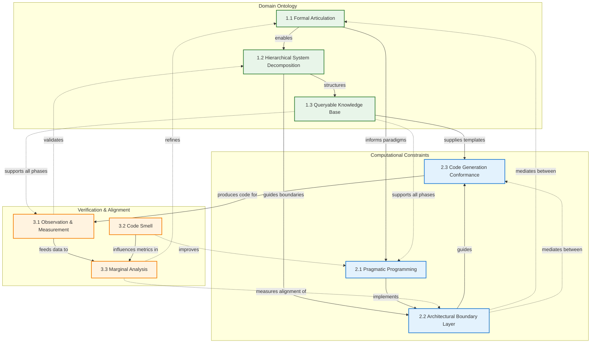

# Framework Matrices and Diagrams

## Cluster-Level Relationship Matrix (3x3)

| From / To | Domain Ontology | Computational Constraints | Verification & Alignment |
|-----------|----------------|---------------------------|-------------------------|
| **Domain Ontology** | — | Defines architecture and decomposition patterns Provides semantic structure for constraints Establishes implementation requirements | Sets validation criteria and invariants Defines measurable properties Provides reference model for comparison |
| **Computational Constraints** | Implements formalized models Provides feasibility feedback Suggests decomposition refinements | — | Produces measurable artifacts Generates code for validation Creates testing targets |
| **Verification & Alignment** | Identifies articulation gaps Measures decomposition effectiveness Validates model completeness | Detects implementation quality issues Ensures constraint compliance Validates generation conformance | — |

## Concept-Level Relationship Matrix (9x9)

**Abbreviation Key:**
- **FA**: Formal Articulation (1.1)
- **HSD**: Hierarchical System Decomposition (1.2)
- **QKB**: Queryable Knowledge Base (1.3)
- **PP**: Pragmatic Programming (2.1)
- **ABL**: Architectural Boundary Layer (2.2)
- **CGC**: Code Generation Conformance (2.3)
- **OM**: Observation & Measurement (3.1)
- **CS**: Code Smell (3.2)
- **MA**: Marginal Analysis (3.3)

| From / To | FA | HSD | QKB | PP | ABL | CGC | OM | CS | MA |
|-----------|------|------|------|------|------|------|------|------|------|
| **FA** | — | Enables decomposition strategy | Populates knowledge structure | Informs programming paradigms | Defines boundary specifications | Establishes semantic requirements | Creates measurable specifications | Defines quality expectations | Sets comparison baseline |
| **HSD** | Validates articulation completeness | — | Structures knowledge hierarchy | Guides modular implementation | Defines subsystem boundaries | Templates subsystem generation | Enables subsystem testing | Identifies complexity hotspots | Measures decomposition accuracy |
| **QKB** | Supports articulation process | Provides decomposition examples | — | Supplies pattern references | Documents boundary decisions | Contains template library | Stores test specifications | Maintains quality benchmarks | Archives comparison history |
| **PP** | Implements formal specifications | Realizes decomposed systems | Queries for best practices | — | Implements boundary contracts | Defines generation patterns | Creates testable units | Establishes quality standards | Produces comparable implementations |
| **ABL** | Translates formal models | Maps decomposition to architecture | References design patterns | Constrains implementation choices | — | Guides template structure | Defines test boundaries | Scopes quality analysis | Delineates comparison domains |
| **CGC** | Generates from formal specs | Instantiates subsystems | Uses knowledge templates | Follows pragmatic patterns | Respects boundary constraints | — | Produces measurable code | Generates analyzable output | Creates comparable artifacts |
| **OM** | Validates articulation correctness | Tests subsystem behavior | Queries expected behaviors | Measures pattern effectiveness | Verifies boundary integrity | Tests generated code | — | Provides runtime quality data | Feeds measurement data |
| **CS** | Identifies articulation ambiguities | Detects decomposition issues | Flags knowledge gaps | Evaluates paradigm compliance | Analyzes boundary violations | Validates generation quality | Correlates with behavior issues | — | Influences quality metrics |
| **MA** | Quantifies articulation gaps | Measures decomposition alignment | Compares knowledge coverage | Evaluates implementation fidelity | Assesses boundary effectiveness | Analyzes generation accuracy | Uses observation data | Incorporates quality metrics | — |

## Framework Structural Diagram

## Key Relationships Summary

**Primary Flow**: Domain Ontology → Computational Constraints → Verification & Alignment
- Mental models are articulated and decomposed
- Constraints guide implementation
- Verification measures alignment

**Critical Feedback Loops**:
- Marginal Analysis → Formal Articulation (refinement cycle)
- Code Smell → Pragmatic Programming (quality improvement)
- Observation & Measurement → Hierarchical Decomposition (validation feedback)

**Cross-Cutting Relationships**:
- Queryable Knowledge Base supports all phases
- Architectural Boundary Layer mediates between domains
- Marginal Analysis synthesizes all verification data