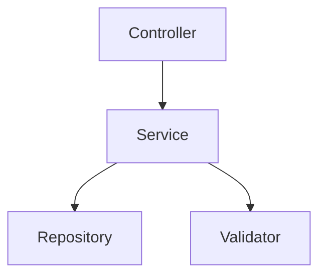

# Computational Mental Models Framework Guide

**Version 0.2** | May 2025

## 1. Introduction

The Computational Mental Models Framework (CM²F) provides a systematic approach for rapidly transforming ideas into functional software systems through constrained development practices. It addresses the critical gap between ideation and implementation, enabling practitioners to validate hypotheses without extensive time investment in coding.

### Target Audience
- IT architects and systems engineers
- Software developers seeking rapid prototyping
- Technical leads managing experimental projects

### Quick Start
```bash
# Install framework tools
pip install cm2f-toolkit

# Create new project
cm2f init my-project

# Start formal specification
cm2f articulate
```

## 2. Core Concepts

### Three-Layer Architecture

The framework operates through three primary layers:

1. **Cognitive Layer**: Mental model articulation and architectural decomposition
2. **Transformation Layer**: Specification-to-code generation with constraints
3. **Validation Layer**: Behavioral verification and gap analysis

### Nine Framework Concepts

**Domain Ontology**
- Formal Articulation
- Hierarchical System Decomposition
- Queryable Knowledge Base

**Computational Constraints**
- Pragmatic Programming
- Architectural Boundary Layer
- Code Generation Conformance

**Verification & Alignment**
- Observation & Measurement
- Code Smell
- Marginal Analysis

## 3. Environment Setup

### Required Tools
```yaml
# cm2f-requirements.yaml
core:
  - python: ">=3.12"
  - alloy-analyzer: "6.0"
  - docker: "latest"

python-packages:
  - uv
  - jinja2
  - libcst
  - hypothesis
  - pyyaml
```

### Container Environment
```dockerfile
FROM python:3.12-slim

# Install framework dependencies
RUN pip install cm2f-toolkit

# Setup workspace
WORKDIR /workspace
VOLUME ["/workspace/specs", "/workspace/src", "/workspace/knowledge"]
```

### IDE Integration
```json
// .vscode/settings.json
{
  "python.linting.enabled": true,
  "python.linting.ruffEnabled": true,
  "cm2f.enableSpecificationLinting": true,
  "cm2f.knowledgeBasePath": "./knowledge"
}
```

## 4. Formal Articulation

### Mental Model Capture
```markdown
# Initial Concept Document
## System Purpose
[One sentence description]

## Core Entities
- Entity 1: [description]
- Entity 2: [description]

## Critical Behaviors
- When [X] happens, [Y] should occur
- [Z] must always be true
```

### Alloy Specification
```alloy
module SystemSpec

sig Entity1 {
    relation: set Entity2
}

fact CoreConstraint {
    // Formal constraint expression
}

assert SystemInvariant {
    // Property to verify
}

check SystemInvariant for 5
```

### Validation Process
1. Run Alloy Analyzer
2. Generate instances
3. Check assertions
4. Refine based on counterexamples

## 5. Hierarchical Decomposition

### System Aspect Analysis
```yaml
aspects:
  data:
    - user_management
    - task_management
  behavioral:
    - authentication_flow
    - task_lifecycle
  cross_cutting:
    - logging
    - validation
```

### Component Architecture
```python
# interfaces.py
from typing import Protocol

class ServiceInterface(Protocol):
    def operation(self, input: InputType) -> OutputType:
        ...

class RepositoryInterface(Protocol):
    def save(self, entity: Entity) -> Entity:
        ...
```

### Dependency Mapping


## 6. Constrained Implementation

### Template Configuration
```yaml
# templates/config.yaml
service_template:
  base: "service_base.j2"
  constraints:
    - no_direct_db_access
    - require_type_hints
    - enforce_protocols
```

### Code Generation
```python
# generate.py
from cm2f import CodeGenerator

generator = CodeGenerator()
generator.load_spec("specs/system.als")
generator.load_templates("templates/")
generator.generate("src/")
```

### Protected Regions
```python
class GeneratedService:
    def operation(self, data: InputType) -> OutputType:
        # Validate preconditions
        self._validate_preconditions(data)
        
        # PROTECTED REGION ID(operation) ENABLED START
        # Custom implementation here
        result = process_data(data)
        # PROTECTED REGION END
        
        # Ensure postconditions
        self._verify_postconditions(result)
        return result
```

## 7. Behavioral Verification

### Property Extraction
```python
# properties.py
from hypothesis import given, strategies as st

class SystemProperties:
    @staticmethod
    def constraint_holds(entity):
        return entity.validate_constraint()
```

### Test Generation
```python
# test_properties.py
@given(entity=entity_strategy())
def test_system_constraint(entity):
    assert SystemProperties.constraint_holds(entity)
```

### Runtime Monitoring
```python
# monitor.py
import sys

def monitor_behavior():
    def trace(frame, event, arg):
        # Check invariants at runtime
        validate_system_state(frame.f_locals)
    
    sys.monitoring.use_tool(0, trace)
```

## 8. Iterative Refinement

### Gap Analysis
```python
# gap_analyzer.py
def analyze_gaps(spec, implementation, test_results):
    return {
        'missing_operations': spec.ops - impl.ops,
        'failed_properties': test_results.failures,
        'coverage_gaps': 1.0 - test_results.coverage
    }
```

### Refinement Strategy
```python
# refine.py
def select_refinement(gap_analysis):
    if gap_analysis['missing_operations']:
        return 'regenerate_code'
    elif gap_analysis['failed_properties']:
        return 'patch_implementation'
    else:
        return 'update_specification'
```

## 9. Knowledge Management

### Pattern Storage
```yaml
# knowledge/patterns/service_pattern.yaml
pattern:
  name: "Repository Service"
  context: "Data access layer"
  solution:
    template: "repository_service.j2"
    constraints:
      - "single_responsibility"
      - "interface_segregation"
```

### Search and Retrieval
```python
# knowledge_base.py
from cm2f import KnowledgeBase

kb = KnowledgeBase("./knowledge")
patterns = kb.search("repository pattern")
kb.apply_pattern(patterns[0], "src/")
```

## 10. Tool Reference

### Core Toolchain
```yaml
specification:
  - alloy-analyzer
  - tla-plus
  - z3-solver

generation:
  - jinja2
  - libcst
  - black

verification:
  - hypothesis
  - pytest
  - coverage

knowledge:
  - pyyaml
  - whoosh
  - networkx
```

### Automation Scripts
```bash
# cm2f-pipeline.sh
#!/bin/bash

# Validate specification
cm2f validate specs/

# Generate code
cm2f generate --spec specs/ --output src/

# Run verification
cm2f verify --implementation src/

# Analyze gaps
cm2f analyze --report gaps.md
```

## 11. Practical Examples

### Web API Development
```alloy
// api_spec.als
sig Endpoint {
    method: one Method,
    path: one Path,
    handler: one Handler
}

sig Handler {
    input: one Schema,
    output: one Schema
}
```

Generated FastAPI code:
```python
@router.post("/tasks")
async def create_task(task: TaskInput) -> TaskOutput:
    # Generated from specification
    validated = validate_input(task)
    result = await task_service.create(validated)
    return format_output(result)
```

### Data Pipeline
```python
# Specification-driven pipeline
@given(data_stream=stream_strategy())
def test_pipeline_properties(data_stream):
    result = pipeline.process(data_stream)
    assert all(validate_output(item) for item in result)
```

## 12. Troubleshooting

### Common Issues

**Specification Counterexamples**
- Issue: Alloy finds unexpected counterexamples
- Solution: Refine constraints, add missing assumptions

**Generation Conflicts**
- Issue: Protected regions conflict with regeneration
- Solution: Use version control, review diffs carefully

**Test Flakiness**
- Issue: Property tests intermittently fail
- Solution: Increase Hypothesis examples, fix non-determinism

### Debug Strategies
```python
# Enable debug logging
import logging
logging.getLogger('cm2f').setLevel(logging.DEBUG)

# Trace generation process
cm2f generate --debug --trace

# Profile verification
cm2f verify --profile
```

### Performance Optimization
- Cache knowledge base queries
- Parallelize test execution
- Use incremental code generation
- Profile specification checking

## Appendix A: Command Reference

```bash
cm2f init         # Initialize new project
cm2f articulate   # Start specification wizard
cm2f decompose    # Analyze system architecture
cm2f generate     # Generate code from specs
cm2f verify       # Run verification suite
cm2f refine       # Execute refinement cycle
cm2f knowledge    # Manage pattern library
```

## Appendix B: Configuration Schema

```yaml
# .cm2f.yaml
project:
  name: "My System"
  version: "0.1.0"

specification:
  language: "alloy"
  path: "specs/"

generation:
  templates: "templates/"
  output: "src/"
  
verification:
  tests: "tests/"
  properties: "properties/"

knowledge:
  path: "knowledge/"
  remote: "https://patterns.cm2f.org"
```
